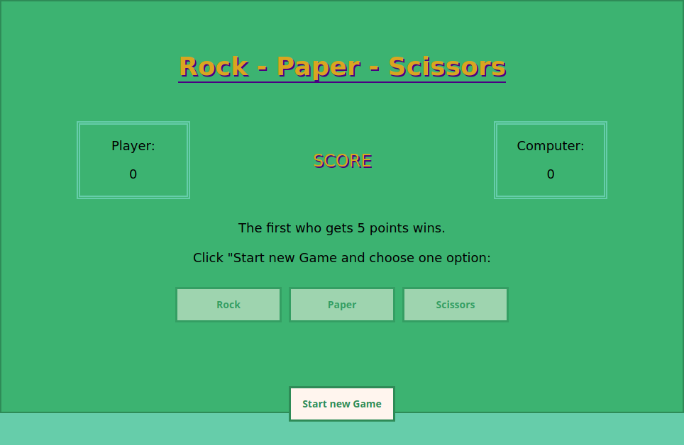

# Rock - Paper - Scissors

This was my first JavaScript project from the Foundations curriculum at [The Odin Project](https://www.theodinproject.com). The goal was to create a [Rock - Paper - Scissors](https://en.wikipedia.org/wiki/Rock_paper_scissors) game. The game is played against an AI that makes random choices. The player chooses by clicking on a button. One game is played over several rounds. The first player who scores 5 points wins.

## Reflection

- This features some of the most basic elements of programming: Variables, functions, eventlisteners ... and at the core there is a rather big if-statement. I started (as was suggested by the task-description) with implementing a single round of play (that is, a single comparison) and then expanded to implement a full game that ends when one player scores 5 points.
- Ironically, I found the CSS to be more challenging than the actual JavaScript programming here. It took me a while to figure out how to apply the animations.

## Demo

[View it here](https://reinimax.github.io/rock-paper-scissors/)
